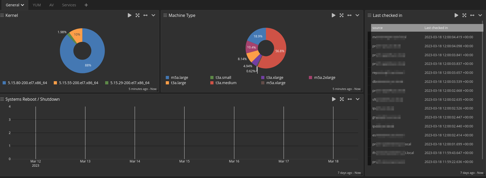

# LDAP Configuration 
[FreeIPA](./FreeIPA.md)


# Inputs
Filebeat
```
    bind_address:
     0.0.0.0
    no_beats_prefix:
     false
    number_worker_threads:
     4
    override_source:
     <empty>
    port:
     5044
    recv_buffer_size:
     1048576
    tcp_keepalive:
     false
    tls_cert_file:
     <empty>
    tls_client_auth:
     disabled
    tls_client_auth_cert_file:
     <empty>
    tls_enable:
     false
    tls_key_file:
     admin
    tls_key_password:
    ********
```
Gelf 
```
    bind_address:
     0.0.0.0
    decompress_size_limit:
     8388608
    number_worker_threads:
     2
    override_source:
     <empty>
    port:
     12202
    recv_buffer_size:
     262144
```         
# Streams

Set up 2 Main streams 
## System events - Linux

## Application logs


# Indices
Set up rotation and retention for logs.


# Pipelines & rules
Create rules, add them to a pipeline and create dedicated stream or dashboard

## Audit & security 
### Audit events
1. Identify and tags
```c
rule "audit_flag_logs"
when
has_field("filebeat_log_file_path") && to_string($message.filebeat_log_file_path) == "/var/log/audit/audit.log"
then
  let message_field = replace(replace(to_string($message.message), "'", ""), "msg=", "");

  set_field("is_auditd", true);  
  set_field("original_message", message_field);
end
```
2. Add keys
```c
rule "audit_add_keys"
when
  has_field("is_auditd")
then
  // extract all key-value from "message" and prefix it with auditd_
  set_fields(
    fields:
      key_value(
        value: to_string($message.original_message),
        trim_value_chars: "\""
      ),
      prefix: "auditd_"
  );
end
```
3. Clean
```c
rule "audit_clean"
when
  (    
  has_field("is_auditd") ||
  has_field("is_secured") ) && has_field("auditd_msg")

then

  // when auditd_msg is present we try to extract the epoch
  // and the sequence number out with grok

  set_fields(
    grok(
      pattern: "audit\\(%{NUMBER:auditd_log_epoch}:%{NUMBER:auditd_log_sequence}\\):",
      value: to_string($message.auditd_msg),
      only_named_captures: true
    )
  );

  // if the epoch was extracted successfully, create a human readable timestamp
  // be aware that the milliseconds will be cut-off as a bug in the lib that is used
  // the time zone might be adjusted to your wanted timezone, default UTC

  set_field("auditd_log_time",
    flex_parse_date(
      value: to_string($message.auditd_log_epoch),
      default: now(),
      timezone: "UTC"
    )
  );

  // remove the unwanted field

  remove_field("auditd_msg");

end
```
### Yum pipeline
1. Identify Yum logs
```c
rule "yum_identify_and_tag"
when
has_field("filebeat_log_file_path") && to_string($message.filebeat_log_file_path) == "/var/log/yum.log"
then
  let tm = substring(to_string($message.message), 0,15);
  let message_field = substring(to_string($message.message), 16);
  set_field("is_yum", true);  
  set_field("message", message_field);
  set_field("original_date", tm);
end
```

2. Extract dates and split messages:
```c
rule "yum_extract_date"

when
  has_field("is_yum") && has_field("original_date")

then
  let current_year = now().year;
  let ts_string = concat(to_string(current_year), concat(" ", to_string($message.original_date)));
  let new_date = parse_date(to_string(ts_string),"yyyy MMM dd HH:mm:ss","UTC");

  set_field("timestamp", new_date);
  remove_field("original_date");
  set_field("yum_action", split(":", to_string($message.message))[0]);
end
```
### ClamAV
1. Pipeline step 1, check log file
	- Freshclam
```c
rule "clamav_fresh"
when
has_field("filebeat_log_file_path") && to_string($message.filebeat_log_file_path) == "/var/log/freshclam.log"
then
 
  let tm = substring(to_string($message.message), 0,15);
  let message_field = substring(to_string($message.message), 16);
  set_field("is_clamd", true); 
  set_field("message", message_field);
  set_field("original_date", tm);
end
```
	- Scan
```c
rule "clamav_scan"
when
has_field("filebeat_log_file_path") && to_string($message.filebeat_log_file_path) == "/var/log/scan.log"
then
 
  let tm = substring(to_string($message.message), 0,15);
  set_field("is_clamd", true); 
  set_field("original_date", tm);
end
```
2. Pipeline step 2, extract keys
```c
rule "clamav_scan_kv_ex_prefix"
 
when
 
  has_field("filebeat_is_scan")
 
then
 
  // extract all key-value from "message" and prefix it with auditd_
  set_fields(
    fields:
      key_value(
        value: to_string($message.original_message),
        delimiters: "\r\n",
        kv_delimiters: ":",
        ignore_empty_values: true,
        trim_value_chars: "\""
      ),
      prefix: "scan_"
  );
 
end
```
### Postfix & Maillog
1. Identify & tag
```c
rule "maillog_identify_and_tag"
when
has_field("filebeat_log_file_path") && to_string($message.filebeat_log_file_path) == "/var/log/maillog"
then
  let message_field = to_string($message.message);
  set_field("is_postfix", true);  
  set_field("original_message", message_field);
end
```
2. Extract keys
```c
rule "postfix_kv_ex_prefix"
when
  has_field("is_postfix") 
then
  // extract all key-value from "message" and prefix it with auditd_
  set_fields(
    fields:
      key_value(
        value: to_string($message.original_message), 
        kv_delimiters: "=",
        trim_value_chars: "\""
      ),
      prefix: "postfix_"
  );

end
```


### Others small extracts
- Fetching content between square brackets and assigning to a key
Extract from custom logs
```c
rule "rec_addprocessor" 
when has_field("filebeat_log_file_path") && to_string($message.filebeat_log_file_path) == "/var/log/scripts/reconciliation.log"
then
let get_prc = regex("\\[(\\w+)\\]", to_string($message.message));
let get_prc_val = to_string(get_prc["0"]);
set_field("processor", to_string(get_prc_val));  
set_field("processor_log", "true");
end

```
- Extract filename uploaded
```c
rule "rec_addfilename" 
when has_field("filebeat_log_file_path") && to_string($message.filebeat_log_file_path) == "/var/log/scripts/reconciliation.log"
then
let msg = to_string($message.message);
let splitfields = split(" ", msg);
set_field("filename", splitfields[1]);
set_field("filetorec", "true");
end
```
- Extract total files collected
```c
rule "rec_addtotalfiles" 
when contains(to_string($message.message), "Total files")
then
let msg = to_string($message.message);
let splitfields = split(" ", msg);
set_field("total_files", splitfields[3]);
end
```

# Screenshots

## PCI dashboard



## Users activity


# Links:
[Graylog basics working with audit logs](https://www.graylog.org/post/back-to-basics-working-with-linux-audit-daemon-log-file/)